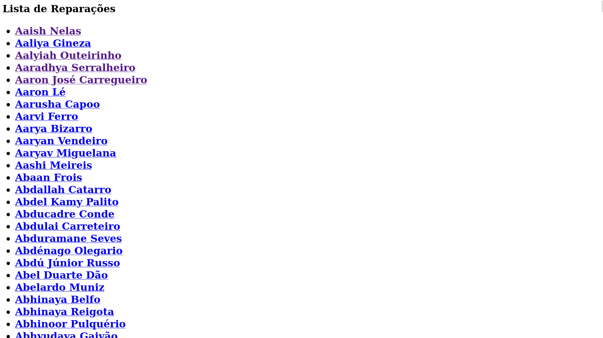
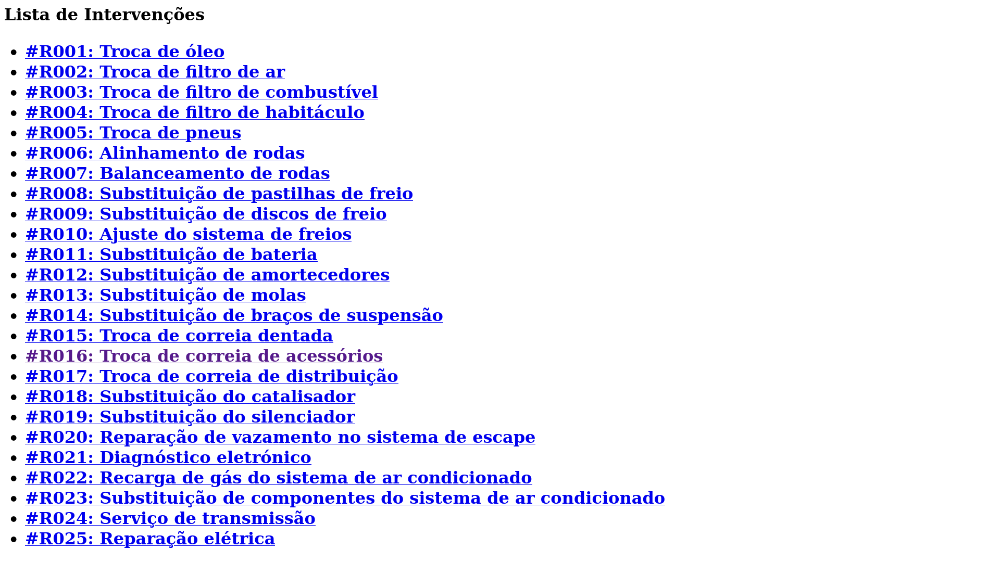
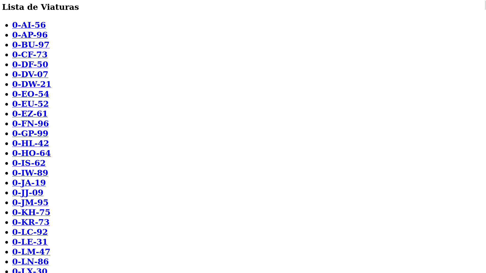

# Manifesto TPC1

## 📌 Informação do TPC e do Aluno  

- **Título:** A Oficina  
- **Data:** 2025-02-11
- **Autor:**  
    <table>
    <tr>
        <td></td>
        <td>
        <strong>Nome:</strong> Paulo Alexandre Rodrigues Ferreira 
        <strong>Número:</strong> A96268
        </td>
    </tr>
    </table>
- **Resumo:**  
Construir um serviço em nodejs, que consuma a API de dados servida pelo json-server da oficina de reparações e responda com as páginas web do site.  
As serviços presentes tem de ter secções para listar as reparações, as intervenções e os veículos. O que se pretende é que na necessidade de se visualizar
informação específica, escolher uma reparação em concreto, por exemplo, terá de redirecionar o utilizador para a página com a informação completa.  
A realização de pedidos de PUTs e POSTs não está presente no escopo deste trabalho.

## 📂 Resultados  

Para iniciar a resolução deste TPC, começámos por delinear as várias páginas e serviços necessários. Vale mencionar que imagens das páginas finais podem ser encontradas na seção [Anexos](#-anexos).  

O resultado final consistiu na identificação de uma página inicial e três páginas de listagem, cada uma delas redirecionando para uma página com detalhes específicos de cada objeto.  

O funcionamento do site é o seguinte: ao acessar a página inicial, o utilizador pode escolher entre três opções — a página de reparações, a página de intervenções ou a página de viaturas.  

- **Página de Reparações**: Apresenta uma lista de reparações realizadas para cada cliente, organizadas pelo nome da pessoa.  
- **Página de Intervenções**: Contém uma lista das intervenções disponíveis na oficina, incluindo os respetivos códigos.  
- **Página de Viaturas**: Exibe todas as viaturas que já passaram pela oficina, organizadas alfabeticamente pela matrícula.  

Em cada uma dessas páginas, é possível abrir informações detalhadas sobre cada item listado.  

## 📎 Anexos  

Aqui estão imagens das páginas mencionadas acima:  

- 🖼️ **Página Inicial:**  
- 🖼️ **Página de Reparações:**
- 🖼️ **Página de Reparação:**
- 🖼️ **Página de Intervenções:**  
- 🖼️ **Página de Intervenção:**  
- 🖼️ **Página de Viaturas:**  
- 🖼️ **Página de Viatura:**  