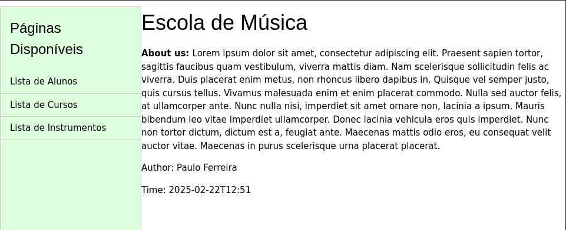
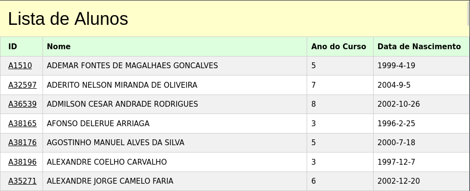
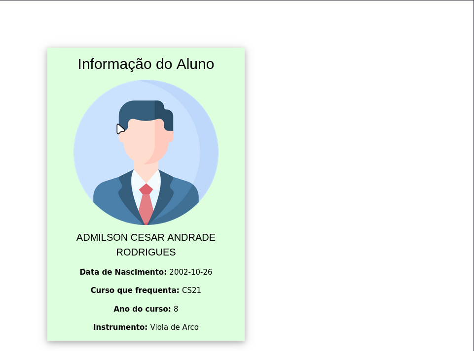
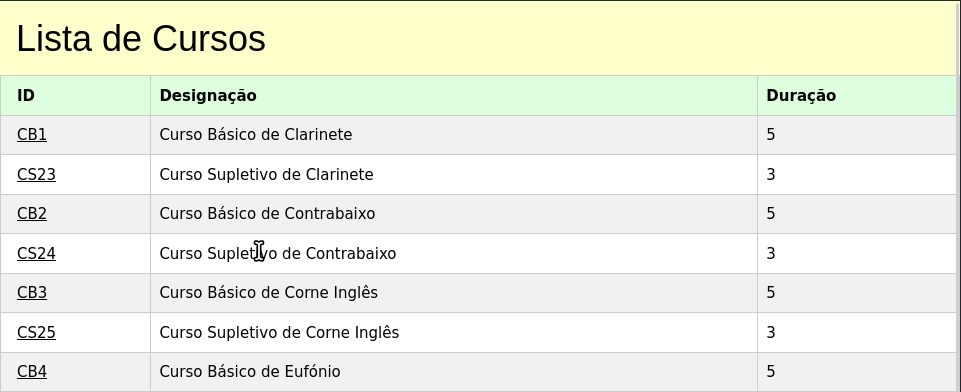
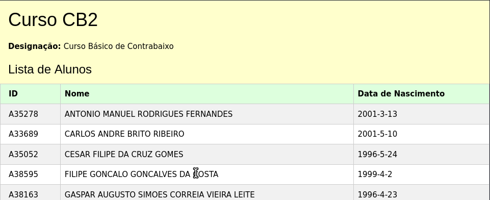
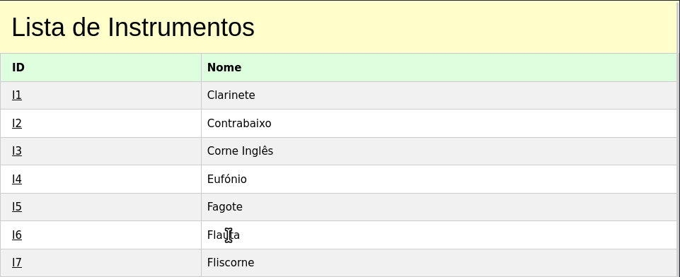
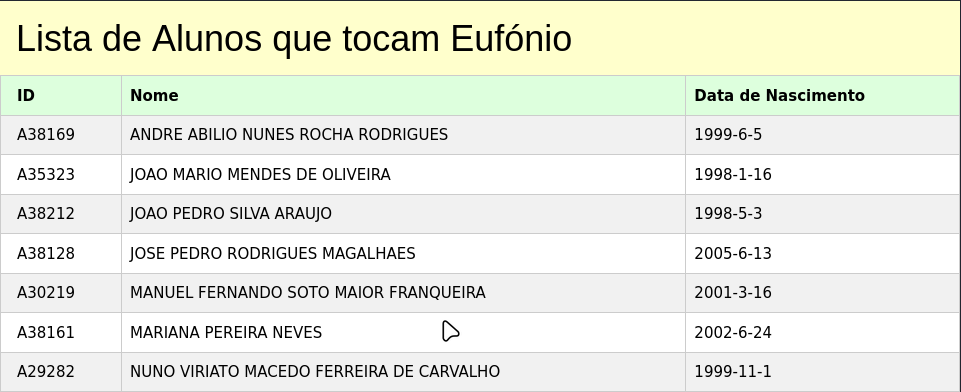

# Manifesto TPC2

## 📌 Informação do TPC e do Aluno  

- **Título:** A Escola de musica  
- **Data:** 2025-02-18
- **Autor:**  
    <table>
    <tr>
        <td></td>
        <td>
        <strong>Nome:</strong> Paulo Alexandre Rodrigues Ferreira<br>
        <strong>Número:</strong> A96268
        </td>
    </tr>
    </table>
- **Resumo:**  
Construir um serviço em nodejs, que consuma a API de dados servida pelo json-server da escola de música e sirva um website com as seguintes características:
- Página principal: Listar alunos, Listar Cursos, Listar Instrumentos;
- Página de alunos: Tabela com a informação dos alunos (clicando numa linha deve saltar-se para a página de aluno);
- Página de cursos: Tabela com a informação dos cursos (clicando numa linha deve saltar-se para a página do curso onde deverá aparecer a lista de alunos a frequentá-lo);
- Página de instrumentos: Tabela com a informação dos instrumentos (clicando numa linha deve saltar-se para página do instrumento onde deverá aparecer a lista de alunos que o tocam);

## 📂 Resultados  

Para iniciar a resolução deste TPC, começámos por delinear as várias páginas e serviços necessários. Vale mencionar que imagens das páginas finais podem ser encontradas na seção [Anexos](#-anexos).  

Á semelhança do [TPC1](../TPC1/README.md) O resultado final consistiu na identificação de uma página inicial e três páginas de listagem, cada uma delas redirecionando para uma página com detalhes específicos de cada objeto, ou com informações ligadas ao mesmo.

O funcionamento do site é o seguinte: ao acessar a página inicial, o utilizador pode escolher entre três opções listadas em uma side bar — a página com a lista de alunos, a página com a lista dos cursos e a página de com a lista de instrumentos.  

- **Página com Lista de Alunos**: Esta página apresenta um lista com todos os alunos da escola, contendo em cada linha o id, o nome, o ano do curso e a data de nascimento de cada aluno.
- **Página com Lista de Cursos**: Nesta página foi colocada uma lista com todos os cursos da escola, tendo o seu id, a sua designação e a sua duração.  
- **Página com Lista de instrumentos**: Por último, esta lista apresenta apresenta todos os instrumentos que são utilizados na escola, revelando o seu id e o seu nome

Após a realização destas páginas, foram também criadas mais páginas com links clicaveis em cada um dos ids, dos objetos listados nas paginas anteriores.

No caso do aluno, é nos exposto uma página com toda a sua informação, desde curso que frequenta, nome e data de nascimento, até o instrumento que o mesmo toca.

No caso das páginas associadas a um curso, estas mostram um lista dos alunos incritos no mesmo, sendo isto semelhante ao que é representado também na página do instrumento. Esta última, apresenta, além da informação básica do instrumento, uma lista de alunos que tocam o mesmo.

Todo este desenvolvivento já foi realizado utilizando os módulos ```express```, ```ejs``` e ```fetch```, ao invés dos módulos ```axios``` e ```http```. A juntar a isto, umas das principais diferenças em relação ao tpc anterior foi a utilização de css com a ajuda do ficheiro disponibilizado pelo site w3schools.

## 📎 Anexos  

Aqui estão imagens das páginas mencionadas acima:  

- 🖼️ **Página Inicial:**  
- 🖼️ **Página Alunos:**
- 🖼️ **Página aluno:**
- 🖼️ **Página Cursos:**  
- 🖼️ **Página Curso:**  
- 🖼️ **Página Instrumentos:**  
- 🖼️ **Página Instrumento:**  